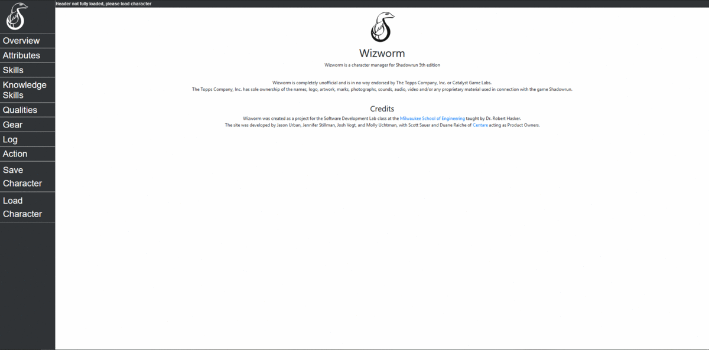

# Shadowrun
# Wizworm, Shadowrun Character Manager
This SDL project is to create a web-based character manager and play assistant for the table top role-playing game Shadowrun 5th edition by The Topps Company, Inc. and Catalyst Game Lab. 

This project was created to help players manage their character's information, like statistics and gear, and perform key calculations needed for gameplay.
The goal of the application is to allow players to spend less time managing their character and spend more time enjoying the features of the game.

# Credits
Started in the 2019-2020 school year by Jennifer Stillman, Molly Uchtman, Josh Vogt, Jason Urban  
with Scott Sauer and Duane Raiche from [Centare](https://www.centare.com/) as product managers.
Continued by Seth Fenske, Nick Marinello, Kam Mitchell, Paul Rinaldi, and Jesse Sierra in the 2020-2021 school year.

# Screenshots

# Framework
This project was programmed in JavaScript with [React](https://reactjs.org/). Bootstrapping came from [Create React App](https://github.com/facebook/create-react-app). 
The project was tested using [Jest](https://jestjs.io/).

# Deployment
The project is deployed at https://shadow-run.netlify.app through Netlify.

# Build
In the project directory, you can run:

### `npm start`

Runs the app in the development mode. 
Open [http://localhost:3000](http://localhost:3000) to view it in the browser.

The page will reload if you make edits. 
You will also see any lint errors in the console.

### `npm run build`

Builds the app for production to the `build` folder. 
It correctly bundles React in production mode and optimizes the build for the best performance.

The build is minified and the filenames include the hashes. 
Your app is ready to be deployed!

See the section about [deployment](https://facebook.github.io/create-react-app/docs/deployment) for more information.

### `npm run eject`

**Note: this is a one-way operation. Once you `eject`, you can’t go back!**

If you aren’t satisfied with the build tool and configuration choices, you can `eject` at any time. This command will remove the single build dependency from your project.

Instead, it will copy all the configuration files and the transitive dependencies (Webpack, Babel, ESLint, etc) right into your project so you have full control over them. All of the commands except `eject` will still work, but they will point to the copied scripts so you can tweak them. At this point you’re on your own.

You don’t have to ever use `eject`. The curated feature set is suitable for small and middle deployments, and you shouldn’t feel obligated to use this feature. However we understand that this tool wouldn’t be useful if you couldn’t customize it when you are ready for it.

## Learn More

You can learn more in the [Create React App documentation](https://facebook.github.io/create-react-app/docs/getting-started).

To learn React, check out the [React documentation](https://reactjs.org/).

### Code Splitting

This section has moved here: https://facebook.github.io/create-react-app/docs/code-splitting

### Analyzing the Bundle Size

This section has moved here: https://facebook.github.io/create-react-app/docs/analyzing-the-bundle-size

### Making a Progressive Web App

This section has moved here: https://facebook.github.io/create-react-app/docs/making-a-progressive-web-app

### Advanced Configuration

This section has moved here: https://facebook.github.io/create-react-app/docs/advanced-configuration

### Deployment

This section has moved here: https://facebook.github.io/create-react-app/docs/deployment

### `npm run build` fails to minify

This section has moved here: https://facebook.github.io/create-react-app/docs/troubleshooting#npm-run-build-fails-to-minify

# Tests

### `npm test`

Launches the test runner in the interactive watch mode. 
See the section about [running tests](https://facebook.github.io/create-react-app/docs/running-tests) for more information.
