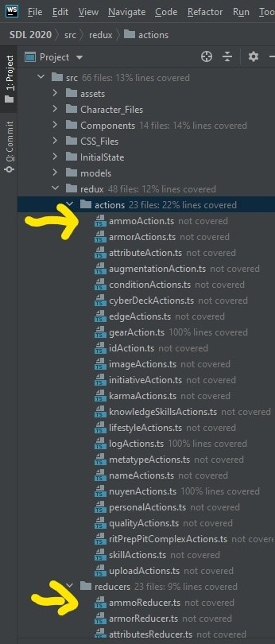
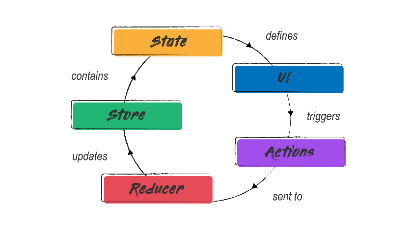
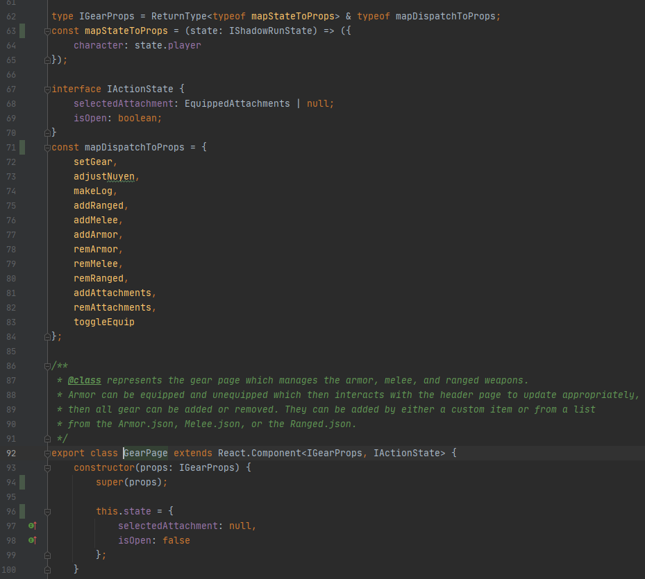
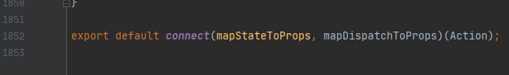
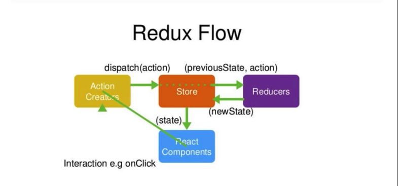
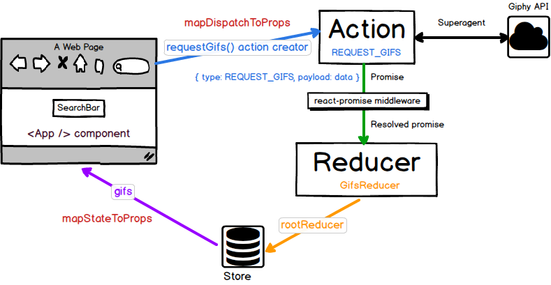

# Redux Guide
The way Redux works can be complicated at first. There is a central store that holds the entire state of the application. Each component can access the stored state without having to send down props from one component to another.
There are three building parts: actions, store, and reducers.
Actions: actions are events, they are only way you can send data from your application to the Redux store. 
Store: the store holds the application state. Highly recommended to only have one store in any application. You access the state stored and can update the state as well. 
Reducers: pure functions (function which given the same input, will always return the same output  and produces no side effects)
## As of Spring 2021: 
-	**action files**  are located in:  src/redux/actions
-	**store.ts** is located in:  src/redux/store.ts
-	**reducer files** are located in:  src/redux/reducers

##Each action is assigned a reducer i.e.

 
 
	 
## In the below class: 

IActionState: represents the state of the player that redux will use to edit. 
mapDispatchToProps: represents the methods from the action files (src/redux/actions) which when called, will go to the reducer file which will be updated in the store and change the state of the player.

  
*YOU NEED TO PUT THIS ABOVE PICTURE AT THE END OF THE CLASS FOR IT TO CONNECT TO THE STORE!*

 

 

 
