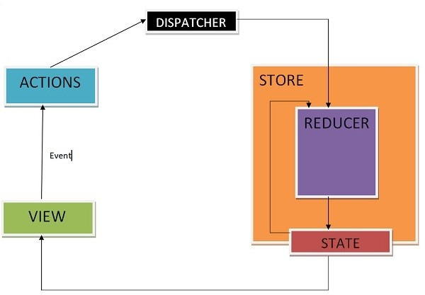

# Redux Guide
The way Redux works can be complicated at first. In React, generally, one class handles its own states and components that are used in that class utilize callbacks provided from that class to update state there. This gets complex. So people introduced redux. In redux, there is a central storage that exists outside of all the components/classes.  

For this application, the character and some other attributes. Each component can access the stored state when the state/props are mapped and pulled from the redux storage.  

There are three essential components when using redux: redux actions, the redux store, and redux reducers.  
- Actions: actions are events, they are only way you can send data from your application to the Redux store. 
- Store: the store holds the application state. Highly recommended to only have one store in any application. You access the state stored and can update the state as well. 
- Reducers: pure functions (function which given the same input, will always return the same output and produces no side effects)

## As of Spring 2021: 
-	**action files**  are located in:  [src/redux/actions](src/redux/actions)
-	**store.ts** is located in:  [src/redux/store.ts](src/redux/store.ts)
-	**reducer files** are located in:  [src/redux/reducers](src/redux/reducers)

## Each action is assigned a reducer i.e.

 
 
	 
## In the below class: 

IActionState: represents the state of the player that redux will use to edit. 
mapDispatchToProps: represents the methods from the action files (src/redux/actions) which when called, will go to the reducer file which will be updated in the store and change the state of the player.

  
***YOU NEED TO PUT THIS ABOVE PICTURE AT THE END OF THE CLASS FOR IT TO CONNECT TO THE STORE!***

  

  

  
 
## Additional references
Follow this guide when confused [https://react-redux.js.org/introduction/getting-started](https://react-redux.js.org/introduction/getting-started)
Why to use redux [https://react-redux.js.org/introduction/why-use-react-redux](https://react-redux.js.org/introduction/why-use-react-redux)
