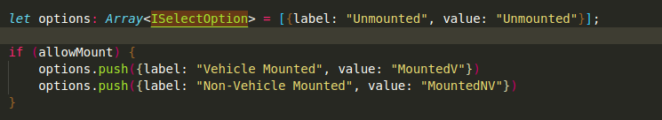

# Typescript Documentation
The way Typescript works can be complicated and unwieldy at first, especially in comparison to vanilla javascript. Using React and Typescript (TS) gets even a little bit more complicated - but we can lean on our understanding of Java interfaces to understand the fundamentals of what's required to make changes to this application.    

## Wins and Tradeoffs
The real win of typescript in this application isn't as pronounced as using redux but it still helps. Typescript lets us declare what types to use for each and every variable or construct of variables we use. This works well for us because we need specificity when the redux store is built but we gain the tradeoff of much more programming time in our application since everything now needs a type; even when reading parts of json - sometimes. 

### Example Win/Tradeoff
For example, in ``` src/models/playerModels.ts ```, we've built a few types, or 'interfaces' to be precise in typescript terminology, to model some shadowrun domain objects:


## Some common rules for React + TS:
- If you will use jsx in a file, you must have the extension .tsx.
- Generally, let ```yarn``` upgrade the versions of TS/React with ^ instead of manually doing so.
- There are various files such as ```react-app-env-d.ts``` and ```jestconfig.js``` that are defined such that typescript + react + jest + js will work together smoothly; be cautious when working on files that seem uneeded. 
- 

## Essential fundamentals:
- 1 - interfaces
- 2 - casting
- 3 - know the javascript types

### Interfaces
From our level of detail required to program this application, interfaces can be considered the same as defining our own primitive types or classes in Java. For a better explanation, reference [url to Educative's blog](https://www.educative.io/blog/typescript-interfaces). A typescript interface is helpful as we'll see below in defining what types exist on an object.  

In Javascript, you could do something very simple as ```let x = {points: 5, slideFactor: 2.0, name: 'thing1'}```  and then reference it later and change ```x['points'] = 'five' ```. In Typescript, you cannot do this. In typescript, you must define an interface for this x variable such as IPoint where point is a number, slideFactor is a number, and name is a string. Then we try to change the variable's value, this will not be possible since a number cannot store a string (though it could be casted/inferred via '2' -> 2). Additioanlly, you cannot use the [] syntax, you must now use x.points only. This forces us to program a little differently to do this type of dynamic setting of a variable. Lastly, it is convention (from Direct Supply) to use 'I' in front of interfaces for clarity. Continue this.  

Ex. Notice the ```?``` on ```specialization?:```; this allows specialization to be optional when creating variables/objects of this type: 
The lower interface in the picture above is used then in the options in a ```<Select/>``` as follows:



### Casting
Use (variable as TYPE) once you have checked that the variable is of TYPE; this is helpful when transforming input (that could be null/undefined) from html/react inputs to javascript values we can work with or our interfaces  
Ex.  -- Notice the check for an undefined or null value first, then we cast (the javascript compiler in browsers may enforce this for you, but it is best practice as well).

### Javascript/TS BuiltIn Types
- JSX.Element for when you wish to make a variable equal to JSX; ex.  - great for returning dynamic JSX 
- number, string, boolean, object, null, undefined, symbol, Array<> (and less commonly used: Map, Set)  (for keys in objects)... [read more](https://developer.mozilla.org/en-US/docs/Web/JavaScript/Data_structures)


## As of Spring 2021: 
-	**ts model files**  are located in:  [src/models/playerModels.ts](src/models/playerModels.ts)

## Learn more
[https://www.typescriptlang.org/docs/handbook/typescript-from-scratch.html](For new javascript prorammers)  
[https://www.typescriptlang.org/docs/handbook/typescript-in-5-minutes.html](For JS programmers)  
[https://www.typescriptlang.org/docs/handbook/typescript-in-5-minutes-oop.html](For java programmers that know some js)  
These guides are all located at [https://www.typescriptlang.org/docs/](https://www.typescriptlang.org/docs/).